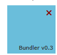
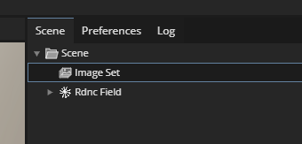
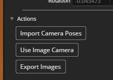

# RealityCapture to Postshot Workflow

This guide outlines the process for converting RealityCapture output into Colmap format for use with Postshot.

## Installing Kapture

1. **Install Kapture using pip**:
   Open a terminal and run the following command:
   ```bash
   pip install kapture
   ```

2. **Locate Essential Scripts**:
   After installation, find `kapture_import_bundler.py` and `kapture_import_colmap.py` scripts. Use the following command in Windows terminal to locate your Python installation directory:
   ```bash
   python -c "import sys; print(sys.executable)"
   ```
   Note the path, such as `C:\Users\<username>\AppData\Local\Programs\Python\Python312\python.exe`, where the scripts are located.

## Exporting from RealityCapture

1. **Prepare Export Folder**:
   - Create a folder named `dataset-bundler` to store the exported files.
   - Set this folder as the destination for the exports.

2. **Export Image List**:
   - Select the option `Original images with image list` to generate an `imagelist.lst` file and copy the images to the folder.
   - 

3. **Export Bundle File**:
   - Choose the `Bundler` option to export a `bundle.out` file.
   - 

## Converting Bundler to Kapture

1. **Organize Images**:
   - Inside `dataset-bundler`, create a subfolder named `images`.
   - Move all images from `dataset-bundler` to the `images` subfolder.

2. **Run Kapture Conversion Script**:
   - Execute the following command to convert the bundler output to Kapture format:
   ```bash
   py <path to kapture_import_bundler.py> -v debug -i dataset-bundler\bundle.out -l dataset-bundler\imagelist-local.lst -im dataset-bundler\images --image_transfer link_absolute -o dataset-kapture --add-reconstruction
   ```

## Converting Kapture to Colmap

1. **Export Kapture to Colmap Format**:
   - Use this command to convert the Kapture data to Colmap:
   ```bash
   py C:\Python310\Scripts\kapture_export_colmap.py -v debug -f -i dataset-kapture -db dataset-colmap\colmap.db --reconstruction dataset-colmap\reconstruction-txt
   ```

## Converting Colmap TXT to BIN

1. **Create Directory for Sparse Model**:
   - Make a directory for the Colmap binary model:
   ```bash
   mkdir dataset-colmap\sparse\0
   ```

2. **Convert Model Format**:
   - Run the Colmap model_converter to switch from TXT to BIN format:
   ```bash
   COLMAP.bat model_converter --input_path dataset-colmap\reconstruction-txt --output_path dataset-colmap\sparse\0 --output_type BIN
   ```

   - This will create a `cameras.bin`, `images.bin`, and `points3D.bin` file in the `sparse\0` directory.

## Importing to Postshot

1. **First import images into postshot**
   - Open Postshot and import the images from the `images` folder in the `dataset-bundler` directory.
   - Then in the Postshot workspace, first select image set:

   

   - Then at the bottom under actions, import the camera poses from the `sparse\0` directory in the `dataset-colmap` folder.

   

   - In the scene you should see the Point Cloud and Cameras from the Colmap reconstruction. 

2. **Start the training process**
   - Start the training process.

