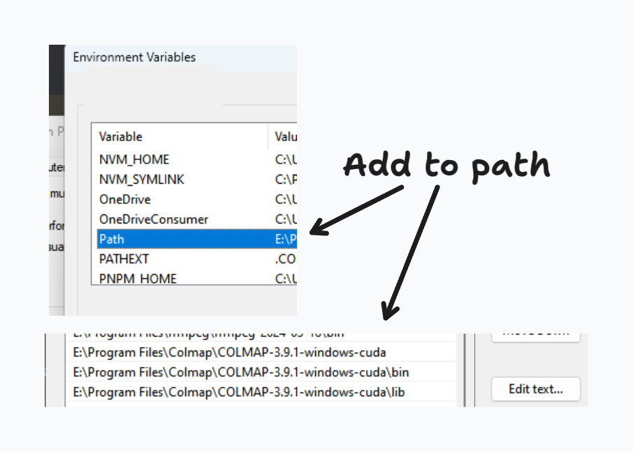
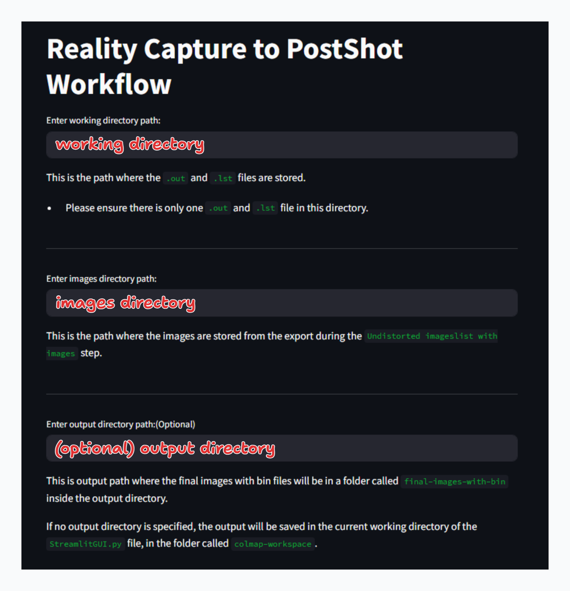
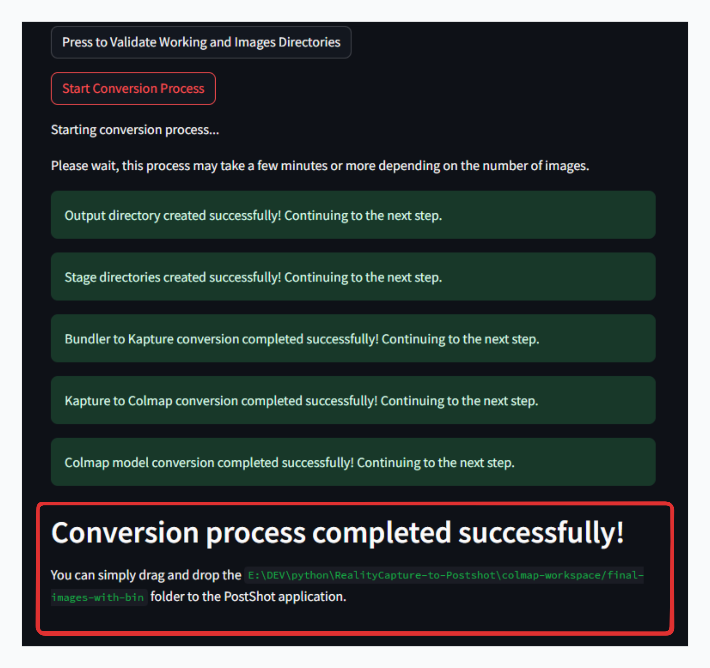
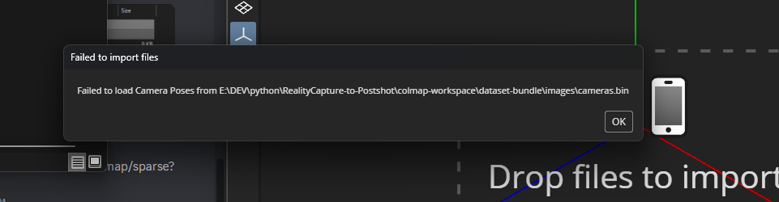

# RealityCapture to Colmap to Postshot Script

> This script was made to simplify the process from this guide: https://gist.github.com/jo-chemla/258e6e40d3d6c2220b29518ff3c17c40 by [jo-chemla](https://gist.github.com/jo-chemla)

This repository contains a Python script designed to automate the process of converting images and data from RealityCapture to a format compatible with Postshot via Colmap.

## Prerequisites

- Ensure you have Python installed on your system, and the `pip` package manager is functional.
- Install Colmap on your system. You can download it from the [Colmap github](https://github.com/colmap/colmap).
- Ensure that `colmap.exe` and `colmap.bat` are exposed on your computer's PATH environment variable. This means that you should be able to run `colmap` from any directory in the command line.

#### **Example paths for colmap exe and bat (<u>depending on your own installation path you need to define</u>):**

(location of colmap.bat)
- `E:\Program Files\Colmap\COLMAP-3.9.1-windows-cuda`     

(location of colmap.exe)
- `E:\Program Files\Colmap\COLMAP-3.9.1-windows-cuda\bin`   

These two paths should be added to your system's PATH as environment variables.



## Installation


- Open your command line terminal and navigate to the directory where you want to store the script.
Example:
```bash
cd C:\<some directory>
```
- Clone the repository:
```bash
git clone https://github.com/Maxiviper117/RealityCapture-to-Postshot
```
- Navigate to the cloned directory:
```bash
cd RealityCapture-to-Postshot
```

## Exporting Files from RealityCapture

### Export Step 1: the Bundler `.out` File

Choose a folder to store the exported file.

1. Set `Fit` option to `Inner Region`.
2. Set `Resolution` option to `Fit`.
3. Ensure `Export Images` is set to `No`.
   - **We will export the images separately in the next step when exporting the `Undistorted images with image list.` export option**


### Export Step 2: the Undistorted Images with Image List

Choose a folder to store the exported file.

1. Set `Fit` option to `Inner Region`.
2. Set `Resolution` option to `Fit`.
3. Under `Export image settings`, choose the desired image format (preferably `jpg` or `jpeg`).
4. Set `Naming Convention` to `original file name`.
5. Enable `Customize image path` and select the folder to store images.
   - Just store the images in a `images` folder in the same directory as the `.lout` and `.lst` files.
6. Leave all other settings as default.


## Running the Script

Back in your terminal, where you have navigated to the cloned directory, run the following command to start the web GUI interface:

```pwsh
streamlit run ./WebGUI.py
```

- Here you must provide the directoy path `working directory` to the folder containing the `.out` and `.lst` files
- As well as the directory path to the folder containing the undistorted images (I added this as you may have choosen a different folder to store the undistorted images in the previous step)
- You can specify the output directory, but it is optional. And it will default a folder named `colmap-workspace` in the working directory.




- Next once you have provided the paths, click on the `Press to Validate Working and Images Directories` button to validate the paths.
- If the paths are valid, another button will appear -> `Start Conversion Process`, press this button to start the conversion process.

## Process Complete

Once the process is complete, you will be shown the folder path where the images and bin files are stored. This folder can be simply dragged and dropped into Postshot to start the import process.



<h3 style="color:#90EE90;">Now you can close the browser tab and stop the terminal process.</h3>

---

<h2 style="color:#FF7F7F;">Failed to import camera poses error.</h2>

If you see this error, when you drag and drop the folder into Postshot, try close and open Postshot again, and drag and drop the folder again.

<!--  -->


